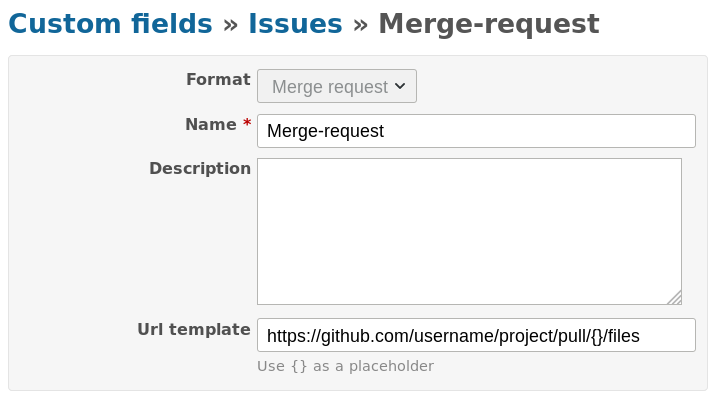

# Redmine merge-request custom field plugin

## compatibility

tested with 4.0.3 version

## description
Provides the ability to add links to merge requests to issue.

The link can be set in several formats:

* 123
* !123
* https://not-default-repo.org/.../.../123/

It is also possible to specify several links to one task (delimiters are space, comma and their combinations).

* 123, 124

It will be displayed like this:

In field settings you can set default merge request url template.

If the template is not specified link not starting on "http" will not be active.

# Installation

Just place in the plugins directory and restart redmine. There is no migrations.
